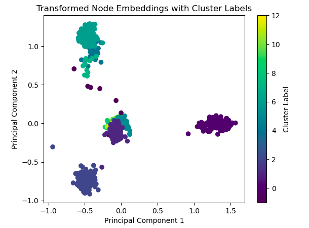

# Visualization of clusters in undirected weighted network graphs

## About this library

This code was used in a project for indentifying chromosome aberrations in Hi-C DNA data, but can also be used for different undirected weighted networks. 
Using the functions in this code you can create a graph from data (in the form of an adjacency matrix of an undirected weighted network) saved in a .txt, remove the isolated nodes, and then retrieve the calculated node embeddings using the node2vec algorithm.
Furthermore can these embeddings be used to find clusters within the network using the HDBSCAN algorithm. 
Then, using Principal Component Analysis (PCA) the node embeddings can be visualized in 2D by reducing the dimensions of the data.
The data is then visualized in a plot through the first two principal components, assigning a different color to each cluster in the network. 
In the case of the Hi-C data, the visualization of the clusters was obtained to identify chromosome aberrations in a cancer cell line, meaning that some chromosomes would be separated into different clusters.

The different parameters/arguments for the different functions and what they return are specified and explained in more detail in the __main__.py file.

## Installation

To install this library, clone the repository and use pip by opening your terminal or command prompt and run the following commands:

```
git clone https://github.com/majagrottum/Visualization-of-clusters-in-undirected-weighted-network-graphs
cd Visualization-of-clusters-in-undirected-weighted-network-graphs
pip install --editable cluster_visualization

```

## Usage

Once you have installed the library, you can import the different functions in the __main__.py file into your Python script or Jupyter Notebook using standard Python import statements. Example of usage of the library is shown below.

```python
import numpy as np
import networkx as nx
from node2vec import Node2Vec
import hdbscan
from sklearn.decomposition import PCA
import matplotlib.pyplot as plt

from cluster_visualization.__main__ import create_graph, remove_isolated_nodes, node_embeddings, embedding_dictionary, clustering_HDBSCAN, principal_component_analysis, plot_cluster_labels

# Create a graph
G = create_graph(filename = 'example_file.txt', splitting = ',')

# Remove the isolated nodes from the graph
remove_isolated_nodes(graph = G)

# Compute the node embeddings and save them in a .txt file
node_embeddings(graph = G, file_name = 'node_embeddings.txt', D = 10, WL = 300, NW = 10, P = 1, Q = 0.5)

# Retrieve the node embeddings from a .txt file
node_embedding_values = embedding_list(file_name = 'node_embeddings.txt')

# Retrieve cluster labels using the HDBSCAN algorithm
cluster_labels = clustering_HDBSCAN(embedding = node_embedding_values)

# Perform dimensionality reduction using PCA
low_dim_embedding = principal_component_analysis(embedding = node_embedding_values)

# Create a 2D plot of the transformed embeddings from PCA colored with cluster labels
plot_cluster_labels(PCA_embedding = low_dim_embedding, labels = cluster_labels)

```

Below is an example of the resulting 2D plot from using the code above with the 'example_file.txt' being a .txt file containing the adjacency matrix of a undirected weighted network from Hi-C 3D DNA data:




